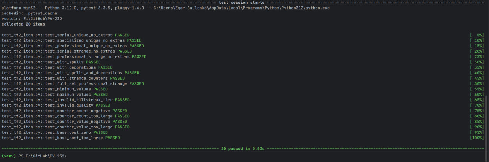

# Лабораторная работа №1

## Составление тест-кейсов для готового кода. Качество ПО и место тестирования в жизненном цикле

Выполнил студент: **Сауленко Егор**.

---

## 1. Анализ исходного модуля

Объект тестирования: функция `calculate_item_cost` (оценка предметов из Team Fortress 2) из модуля `tf2_item.py`.

Функция рассчитывает стоимость предмета из Team Fortress 2 в ключах по семи входным параметрам. Функция шуточная и отсылает к альбому "Четыре позиции Бруно", но оформлена по всем правилам тестирования.

| Параметр | Назначение | Допустимые значения | Недопустимые значения |
| --- | --- | --- | --- |
| `killstreak_tier: str` | Набор убийц | `"serial"`, `"specialized"`, `"professional"` | Любое другое значение |
| `quality: str` | Качество предмета | `"unique"` или `"strange"` | Любое другое значение |
| `has_spells: bool` | Наличие спеллов | `True`, `False` | Не bool |
| `strange_counter_count: int` | Количество странных счетчиков | Целое от `0` до `10` включительно | Число `< 0` или `> 10` |
| `strange_counter_value: float` | Стоимость странного счетчика | Число от `0` до `1000` включительно | Число `< 0` или `> 1000` |
| `base_cost: float` | Базовая стоимость предмета | Число от `0` (не включая) до `10000` включительно | Число `<= 0` или `> 10000` |
| `has_decorations: bool` | Наличие украшений | `True`, `False` | Не bool |
| Результат `float` | Итоговая стоимость в ключах | Неотрицательное число, округленное до 2 знаков | При некорректных входных данных вместо результата выбрасывается `ValueError` |

Бизнес-правила:

1. Если `killstreak_tier` не входит в `("serial", "specialized", "professional")`, выбрасывается `ValueError`.
2. Если `quality` не входит в `("unique", "strange")`, выбрасывается `ValueError`.
3. Если `strange_counter_count` не целое или вне диапазона `0..10`, выбрасывается `ValueError`.
4. Если `strange_counter_value` вне диапазона `0..1000`, выбрасывается `ValueError`.
5. Если `base_cost` вне диапазона `(0, 10000]`, выбрасывается `ValueError`.
6. Если `has_spells` или `has_decorations` не bool, выбрасывается `ValueError`.
7. Множитель убийств: `serial` дает `1.0`, `specialized` дает `1.5`, `professional` дает `2.5`.
8. Множитель качества: `unique` дает `1.0`, `strange` дает `1.8`.
9. Если есть спеллы, добавляется множитель `1.4`.
10. Если есть украшения, добавляется множитель `1.2`.
11. Стоимость счетчиков = `strange_counter_count * strange_counter_value * 0.01`.
12. Итог = `base_cost * killstreak_factor * quality_factor * spell_factor * decoration_factor + counter_cost`.
13. Итог округляется до двух знаков после запятой.
14. Итог не может быть отрицательным.

Классы эквивалентности:

| Параметр | Классы |
| --- | --- |
| `killstreak_tier` | `serial`; `specialized`; `professional`; недопустимое значение |
| `quality` | `unique`; `strange`; недопустимое значение |
| `has_spells` | `True`; `False` |
| `strange_counter_count` | меньше `0`; `0`; `1..5`; `6..10`; больше `10` |
| `strange_counter_value` | меньше `0`; `0`; `1..500`; `501..1000`; больше `1000` |
| `base_cost` | `<= 0`; `0.01..100`; `100..1000`; `1000..10000`; больше `10000` |
| `has_decorations` | `True`; `False` |

Граничные значения:

- для набора убийц: `"serial"`, `"specialized"`, `"professional"`, `"legendary"`;
- для качества: `"unique"`, `"strange"`, `"vintage"`;
- для количества счетчиков: `-1`, `0`, `10`, `11`;
- для стоимости счетчика: `-1`, `0`, `1000`, `1001`;
- для базовой стоимости: `0`, `0.01`, `10000`, `10001`;
- для спеллов и украшений: `True`, `False`.

---

## 2. Тест-кейсы

Предусловие: проект открыт из корня репозитория, активировано виртуальное окружение `.venv`, зависимости установлены командой `python -m pip install -r requirements.txt`, функция импортируется из `tf2_item.py`.

Шаги для позитивных тест-кейсов: вызвать `calculate_item_cost` с указанными входными данными и сравнить результат с ожидаемым значением.

Шаги для негативных тест-кейсов: вызвать `calculate_item_cost` с некорректными входными данными и проверить, что выбрасывается `ValueError`.

Постусловие: функция не изменяет состояние программы и не имеет побочных эффектов.

| ID | Название / тип | Входные данные | Ожидаемый результат | Фактический результат / статус |
| --- | --- | --- | --- | --- |
| TC-01 | Серийный уникальный без всего / позитивный | `("serial", "unique", False, 0, 0, 10, False)` | `10.0` | `10.0` / PASS |
| TC-02 | Особо опасный уникальный / позитивный | `("specialized", "unique", False, 0, 0, 10, False)` | `15.0` | `15.0` / PASS |
| TC-03 | Профессиональный уникальный / позитивный | `("professional", "unique", False, 0, 0, 10, False)` | `25.0` | `25.0` / PASS |
| TC-04 | Серийный странный / позитивный | `("serial", "strange", False, 0, 0, 10, False)` | `18.0` | `18.0` / PASS |
| TC-05 | Профессиональный странный / позитивный | `("professional", "strange", False, 0, 0, 10, False)` | `45.0` | `45.0` / PASS |
| TC-06 | Со спеллами / позитивный | `("serial", "unique", True, 0, 0, 10, False)` | `14.0` | `14.0` / PASS |
| TC-07 | С украшениями / позитивный | `("serial", "unique", False, 0, 0, 10, True)` | `12.0` | `12.0` / PASS |
| TC-08 | Со спеллами и украшениями / позитивный | `("serial", "unique", True, 0, 0, 10, True)` | `16.8` | `16.8` / PASS |
| TC-09 | Со странными счетчиками / позитивный | `("serial", "unique", False, 5, 100, 10, False)` | `15.0` | `15.0` / PASS |
| TC-10 | Полный набор / позитивный | `("professional", "strange", True, 3, 200, 50, True)` | `384.0` | `384.0` / PASS |
| TC-11 | Минимальные значения на границе / граничный | `("serial", "unique", False, 0, 0, 0.01, False)` | `0.01` | `0.01` / PASS |
| TC-12 | Максимальные значения на границе / граничный | `("professional", "strange", True, 10, 1000, 10000, True)` | `75700.0` | `75700.0` / PASS |
| TC-13 | Неверный набор убийц / негативный | `("legendary", "unique", False, 0, 0, 10, False)` | `ValueError` | `ValueError` / PASS |
| TC-14 | Неверное качество / негативный | `("serial", "vintage", False, 0, 0, 10, False)` | `ValueError` | `ValueError` / PASS |
| TC-15 | Количество счетчиков меньше 0 / негативный | `("serial", "unique", False, -1, 0, 10, False)` | `ValueError` | `ValueError` / PASS |
| TC-16 | Количество счетчиков больше 10 / негативный | `("serial", "unique", False, 11, 0, 10, False)` | `ValueError` | `ValueError` / PASS |
| TC-17 | Стоимость счетчика меньше 0 / негативный | `("serial", "unique", False, 0, -1, 10, False)` | `ValueError` | `ValueError` / PASS |
| TC-18 | Стоимость счетчика больше 1000 / негативный | `("serial", "unique", False, 0, 1001, 10, False)` | `ValueError` | `ValueError` / PASS |
| TC-19 | Базовая стоимость равна 0 / негативный | `("serial", "unique", False, 0, 0, 0, False)` | `ValueError` | `ValueError` / PASS |
| TC-20 | Базовая стоимость больше 10000 / негативный | `("serial", "unique", False, 0, 0, 10001, False)` | `ValueError` | `ValueError` / PASS |

---

## 3. Автотесты и запуск

Автотесты реализованы на `pytest` в файле `test_tf2_item.py`. Каждый тест-кейс оформлен отдельной функцией с понятным именем.

Команды запуска из корня проекта:

```bash
source .venv/bin/activate
python -m pytest -v
```

Результат запуска:

```text
20 passed in 0.03s
```



---

## 4. Покрытые ветви кода

Тесты покрывают следующие ветви функции:

| Условие | Покрытая ветка `True` | Покрытая ветка `False` |
| --- | --- | --- |
| `killstreak_tier` недопустимый | TC-13 | TC-01 - TC-12, TC-14 - TC-20 |
| `quality` недопустимый | TC-14 | TC-01 - TC-13, TC-15 - TC-20 |
| `strange_counter_count` вне диапазона | TC-15, TC-16 | TC-01 - TC-14, TC-17 - TC-20 |
| `strange_counter_value` вне диапазона | TC-17, TC-18 | TC-01 - TC-16, TC-19, TC-20 |
| `base_cost` вне диапазона | TC-19, TC-20 | TC-01 - TC-18 |
| `killstreak_tier == "serial"` | TC-01, TC-04, TC-06 - TC-09, TC-11 | TC-02, TC-03, TC-05, TC-10, TC-12 - TC-20 |
| `killstreak_tier == "specialized"` | TC-02 | TC-01, TC-03 - TC-20 |
| `killstreak_tier == "professional"` | TC-03, TC-05, TC-10, TC-12 | TC-01, TC-02, TC-04, TC-06 - TC-09, TC-11, TC-13 - TC-20 |
| `quality == "unique"` | TC-01 - TC-03, TC-06 - TC-09, TC-11 | TC-04, TC-05, TC-10, TC-12 - TC-20 |
| `quality == "strange"` | TC-04, TC-05, TC-10, TC-12 | TC-01 - TC-03, TC-06 - TC-09, TC-11, TC-13 - TC-20 |
| `has_spells` | TC-06, TC-08, TC-10, TC-12 | TC-01 - TC-05, TC-07, TC-09, TC-11, TC-13 - TC-20 |
| `has_decorations` | TC-07, TC-08, TC-10, TC-12 | TC-01 - TC-06, TC-09, TC-11, TC-13 - TC-20 |
| `strange_counter_count > 0` | TC-09, TC-10, TC-12 | TC-01 - TC-08, TC-11, TC-13 - TC-20 |
| округление `round(result, 2)` | TC-09, TC-11, TC-12 | остальные (значения уже целые или с одним знаком) |
| ограничение `max(0.0, ...)` | не срабатывает (значения всегда положительные) | TC-01 - TC-12 |

Таким образом, проверены:

- позитивные сценарии для каждого уровня убийств (`serial`, `specialized`, `professional`);
- негативные сценарии для всех недопустимых значений;
- граничные значения для количества счетчиков (`0`, `10`), их стоимости (`0`, `1000`) и базовой стоимости (`0.01`, `10000`);
- влияние качества (`unique` и `strange`);
- влияние спеллов и украшений;
- влияние странных счетчиков;
- комбинированный случай "полный набор";
- округление результата до двух знаков после запятой.

Нижнее ограничение (`max(0.0, ...)`) при текущей формуле не срабатывает никогда, так как все множители положительные. Этот риск отмечен в выводах.

---

## 5. Вывод

Тестирование связывает требования с фактическим поведением программы. В этой лабораторной работе тесты показали, что функция `calculate_item_cost` корректно обрабатывает все входные диапазоны, граничные значения, влияние набора убийц, качества, спеллов, украшений и странных счетчиков.

Формула построена на умножении базовой стоимости на несколько множителей (набор убийств, качество, спеллы, украшения) плюс добавление стоимости странных счетчиков. Такая структура дает предсказуемый результат и позволяет легко расширять список модификаторов в будущем.

В жизненном цикле ПО такие автотесты важны потому, что они помогают быстро находить регрессии после изменений кода, подтверждают выполнение бизнес-правил и повышают доверие к качеству программы. Запуск тестов в CI делает эту проверку автоматической: ошибка обнаруживается сразу после `push`, а не при ручной проверке.

При этом тесты не заменяют требования и проектирование. В данной работе остался непокрытым риск, связанный с нижним ограничением результата (`max(0.0, ...)`): при текущей формуле оно не срабатывает никогда, так как все множители положительные и базовая стоимость строго больше нуля. Чтобы закрыть этот риск, можно либо убрать это ограничение как избыточное, либо добавить тест с такими данными, где результат теоретически мог бы уйти в минус.