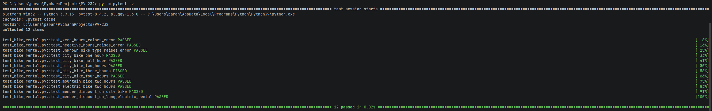

# Лабораторная работа №1

## Составление тест-кейсов для готового кода. Качество ПО и место тестирования в жизненном цикле

Выполнил студент: **Смольяков Артём**.

---

## 1. Анализ исходного модуля

Объект тестирования: функция `calculate_bike_rental` (расчёт стоимости аренды велосипеда) из модуля `bike_rental.py`.

Функция рассчитывает стоимость аренды велосипеда в рублях по трём входным параметрам: время аренды, тип велосипеда и признак участника клуба. Тарификация прогрессивная — чем дольше аренда, тем дешевле каждый следующий час относительно базовой ставки.

| Параметр | Назначение | Допустимые значения | Недопустимые значения |
| --- | --- | --- | --- |
| `hours: float` | Время аренды в часах | Число строго больше `0` | Число `<= 0` |
| `bike_type: str` | Тип велосипеда | `"city"`, `"mountain"`, `"electric"` | Любое другое значение |
| `is_member: bool` | Участник клуба | `True`, `False` | Не bool |
| Результат `float` | Итоговая стоимость в рублях | Неотрицательное число, округлённое до 2 знаков | При некорректных входных данных вместо результата выбрасывается `ValueError` |

Бизнес-правила:

1. Если `hours <= 0`, выбрасывается `ValueError`.
2. Если `bike_type` не входит в `("city", "mountain", "electric")`, выбрасывается `ValueError`.
3. Базовая ставка за первый час: `city` — 150 руб., `mountain` — 250 руб., `electric` — 400 руб.
4. Второй и третий час аренды оплачиваются как 80% от базовой ставки за каждый.
5. Каждый час, начиная с четвёртого, оплачивается как 60% от базовой ставки.
6. Для участников клуба (`is_member = True`) применяется скидка 15% на итоговую сумму.
7. Скидка применяется после расчёта стоимости по часам, до округления.
8. Итог округляется до двух знаков после запятой.
9. Дробные значения часов допускаются (например, полчаса аренды).
10. Итог не может быть отрицательным.

Классы эквивалентности:

| Параметр | Классы |
| --- | --- |
| `hours` | `<= 0`; `0 < hours <= 1`; `1 < hours <= 3`; `hours > 3` |
| `bike_type` | `city`; `mountain`; `electric`; недопустимое значение |
| `is_member` | `True`; `False` |

Граничные значения:

- для времени аренды: `0`, `0.5`, `1`, `3`, `3.01`, `4`;
- для типа велосипеда: `"city"`, `"mountain"`, `"electric"`, `"scooter"`;
- для признака участника клуба: `True`, `False`.

---

## 2. Тест-кейсы

Предусловие: проект открыт из корня репозитория, активировано виртуальное окружение `.venv`, зависимости установлены командой `python -m pip install -r requirements.txt`, функция импортируется из `bike_rental.py`.

Шаги для позитивных тест-кейсов: вызвать `calculate_bike_rental` с указанными входными данными и сравнить результат с ожидаемым значением.

Шаги для негативных тест-кейсов: вызвать `calculate_bike_rental` с некорректными входными данными и проверить, что выбрасывается `ValueError`.

Постусловие: функция не изменяет состояние программы и не имеет побочных эффектов.

| ID | Название / тип | Входные данные | Ожидаемый результат | Фактический результат / статус |
| --- | --- | --- | --- | --- |
| TC-01 | Ноль часов / негативный, граничный | `(0, "city", False)` | `ValueError` | `ValueError` / PASS |
| TC-02 | Отрицательное время / негативный | `(-1, "city", False)` | `ValueError` | `ValueError` / PASS |
| TC-03 | Неизвестный тип велосипеда / негативный | `(1, "scooter", False)` | `ValueError` | `ValueError` / PASS |
| TC-04 | Городской велосипед, 1 час / позитивный, граничный | `(1, "city", False)` | `150.0` | `150.0` / PASS |
| TC-05 | Полчаса аренды / позитивный | `(0.5, "city", False)` | `75.0` | `75.0` / PASS |
| TC-06 | Городской велосипед, 2 часа / позитивный, граничный | `(2, "city", False)` | `270.0` | `270.0` / PASS |
| TC-07 | Городской велосипед, 3 часа / позитивный, граничный | `(3, "city", False)` | `390.0` | `390.0` / PASS |
| TC-08 | Городской велосипед, 4 часа / позитивный, граничный | `(4, "city", False)` | `480.0` | `480.0` / PASS |
| TC-09 | Горный велосипед, 2 часа / позитивный | `(2, "mountain", False)` | `450.0` | `450.0` / PASS |
| TC-10 | Электровелосипед, 2 часа / позитивный | `(2, "electric", False)` | `720.0` | `720.0` / PASS |
| TC-11 | Скидка участника клуба, городской / позитивный | `(2, "city", True)` | `229.5` | `229.5` / PASS |
| TC-12 | Скидка клуба + длинная аренда электровелосипеда / позитивный | `(4, "electric", True)` | `1088.0` | `1088.0` / PASS |

---

## 3. Автотесты и запуск

Автотесты реализованы на `pytest` в файле `test_bike_rental.py`. Каждый тест-кейс оформлен отдельной функцией с понятным именем.

Команды запуска из корня проекта:

```bash
py -m pip install pytest
py -m pytest -v
```

Результат запуска:




---

## 4. Покрытые ветви кода

Тесты покрывают следующие ветви функции:

| Условие | Покрытая ветка `True` | Покрытая ветка `False` |
| --- | --- | --- |
| `hours <= 0` | TC-01, TC-02 | TC-03 - TC-12 |
| `bike_type` не в словаре `rates` | TC-03 | TC-01, TC-02, TC-04 - TC-12 |
| `hours <= 1` | TC-04, TC-05 | TC-06 - TC-12 |
| `1 < hours <= 3` | TC-06, TC-07, TC-09, TC-10, TC-11 | TC-04, TC-05, TC-08, TC-12 |
| `hours > 3` | TC-08, TC-12 | TC-01 - TC-07, TC-09 - TC-11 |
| `bike_type == "city"` | TC-01, TC-02, TC-04 - TC-08, TC-11 | TC-03, TC-09, TC-10, TC-12 |
| `bike_type == "mountain"` | TC-09 | TC-01 - TC-08, TC-10 - TC-12 |
| `bike_type == "electric"` | TC-10, TC-12 | TC-01 - TC-09, TC-11 |
| `is_member == True` | TC-11, TC-12 | TC-01 - TC-10 |
| округление `round(total, 2)` | TC-11 (`229.5`), TC-12 (`1088.0`) | TC-04 - TC-10 (значения уже целые) |

Таким образом, проверены:

- позитивные сценарии для каждого типа велосипеда (`city`, `mountain`, `electric`);
- негативные сценарии для недопустимого времени (`0`, отрицательное) и неизвестного типа;
- граничные значения по времени: `0.5`, `1`, `3`, `4`;
- все три тарифные зоны (первый час, часы 1–3, часы свыше 3);
- применение скидки участника клуба отдельно и в комбинации с прогрессивным тарифом;
- округление результата до двух знаков после запятой.

---

## 5. Вывод

Тестирование связывает требования с фактическим поведением программы. В этой лабораторной работе тесты показали, что функция `calculate_bike_rental` корректно обрабатывает все входные диапазоны: проверяет время аренды и тип велосипеда, правильно применяет прогрессивную тарификацию (полная ставка за первый час, 80% за часы 2–3, 60% начиная с четвёртого), а также корректно считает скидку 15% для участников клуба.

Формула построена на суммировании стоимости часов с разными коэффициентами, после чего применяется множитель скидки. Такая структура предсказуема и легко расширяется: например, если появится новый тип велосипеда или дополнительный уровень скидки, достаточно будет добавить пару тестов.

В жизненном цикле ПО такие автотесты важны потому, что они помогают быстро находить регрессии после изменений кода, подтверждают выполнение бизнес-правил и повышают доверие к качеству программы. Запуск тестов в CI делает эту проверку автоматической: ошибка обнаруживается сразу после `push`, а не при ручной проверке.

При этом тесты не заменяют требования и проектирование. В данной работе остались непокрытыми несколько рисков:

- передача значений неверного типа (`None`, строка, `NaN`) — сейчас функция упадёт с `TypeError` или `ValueError`, но это поведение не зафиксировано тестами;
- регистр в `bike_type` (`"City"`, `"CITY"`) — сейчас это приведёт к `ValueError`, хотя пользователь мог иметь в виду корректный тип;
- очень большие значения `hours` и связанные с этим проблемы точности `float`;
- отсутствие проверки поведения при передаче `is_member` не-булевым значением (например, `1` или `"yes"`).

Чтобы закрыть эти риски, можно добавить тесты на типы данных, привести `bike_type` к нижнему регистру внутри функции и явно валидировать булевы параметры.